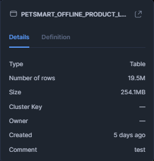

# Automatizando Transformações de Dados no Snowflake com DBT

# Conteúdo

1. [Visão Geral do Projeto](#visão-geral-do-projeto)
2. [Introdução](#introdução)
3. [Etapas do Projeto](#etapas-do-projeto)
4. [Análise de Custo e Performance do Processo ETL](#análise-de-custo-e-performance-do-processo-etl)
5. [O que é o DBT?](#o-que-é-o-dbt)
6. [Organização no DBT](#organização-no-dbt)
   - [Definindo o Tipo de Materializações](#definindo-o-tipo-de-materializações)
   - [Seeds](#seeds)
   - [Análises](#análises)
   - [Fontes](#fontes)
   - [Testes](#testes)
   - [Documentação do DBT](#documentação-do-dbt)
   - [JINJA](#jinja)
   - [Macros](#macros)
   - [Pacotes](#pacotes)
   - [Implementando o Teste de Combinação Única de Colunas](#implementando-o-teste-de-combinação-única-de-colunas)
   - [Configurando a Tabela fSales como Incremental](#configurando-a-tabela-fsales-como-incremental)
   - [Snapshots](#snapshots)
7. [Mapeamento das Implementações do DBT](#mapeamento-das-implementações-do-dbt)
8. [Comparando os Resultados](#comparando-os-resultados)
9. [Conclusões e Próximos Passos](#conclusões-e-próximos-passos)

## Visão Geral do Projeto
O principal objetivo deste projeto é transformar dados dentro de um pipeline ELT para melhorar o desempenho de consultas e otimizar transformações usando DBT. Inicialmente, o processo será realizado dentro de uma arquitetura tradicional de dados com três estágios: Raw, Staging e Data Warehouse (DW). O foco será comparar o ETL tradicional com o ELT, explorando como o uso do DBT pode trazer benefícios de performance e escalabilidade. Em um pipeline ETL tradicional, as transformações são feitas antes de carregar os dados no Data Warehouse, enquanto no ELT, as transformações são realizadas diretamente no DW, aproveitando as poderosas capacidades de processamento das plataformas de nuvem como o Snowflake.

## Introdução

A escolha de usar o DBT (Data Build Tool) para a etapa de transformação (T) do pipeline ELT é motivada por várias razões, tornando essa ferramenta altamente eficaz no processamento e modelagem de dados, especialmente em ambientes modernos de arquitetura de dados. O DBT se destaca no processo de transformação de dados devido à sua simplicidade e seu foco em SQL, uma linguagem amplamente conhecida por analistas e engenheiros de dados.  
O DBT tem duas versões principais: a versão Core, que é open-source, e a versão Cloud, que oferece funcionalidades adicionais para colaboração em equipe e gerenciamento de ambiente. Neste projeto, utilizarei a versão Core, que é completamente gratuita.  
Ao contrário de outras ferramentas ETL tradicionais, o DBT não requer conhecimento complexo de programação ou integração com sistemas específicos. Ele permite que os profissionais de dados trabalhem com SQL, o que é familiar e já utilizado no trabalho diário de analistas e engenheiros de dados. Além disso, o DBT foi projetado para integrar-se com plataformas de nuvem modernas, como BigQuery, Redshift e Snowflake. No contexto deste projeto, usaremos o Snowflake na versão de avaliação de 30 dias com $400 em créditos para processamento de dados.

### Dicionário de Dados de Nível de Produto

As tabelas de nível de produto contêm dados de vendas offline em lojas de comércio eletrônico. Inclui detalhes chave, como identificadores de produto, informações sobre a loja, desempenho de vendas e métricas de receita. Esses são os dados com os quais trabalharei para o processo ETL. Para mais detalhes, consulte a fonte: [Dicionário de Dados de Nível de Produto - Grips Intelligence](https://github.com/gripsintelligence/productlevel-data-dictionary).

## Colunas e Descrições

| Nome da Coluna | Tipo de Dados      | Descrição                                          | Exemplo                        |
|----------------|--------------------|----------------------------------------------------|--------------------------------|
| SKU            | VARCHAR(16777216)   | Identificador único do produto (SKU).              | 12345-AB                       |
| URL            | VARCHAR(16777216)   | URL do produto.                                    | https://example.com/product/123 |
| PAÍS           | VARCHAR(16777216)   | País onde a venda ocorreu.                        | EUA                            |
| STOREID        | VARCHAR(16777216)   | ID da loja onde o produto foi vendido.             | 001234                         |
| ZIP            | VARCHAR(16777216)   | Código postal da localização da loja.             | 90210                          |
| CIDADE         | VARCHAR(16777216)   | Cidade da loja.                                   | Los Angeles                    |
| ESTADO         | VARCHAR(16777216)   | Estado da loja.                                   | Califórnia                     |
| ENDEREÇO       | VARCHAR(16777216)   | Endereço da loja.                                  | 123 Main St                    |
| TÍTULO         | VARCHAR(16777216)   | Título ou nome do produto.                        | Cama Deluxe para Cães          |
| MARCA          | VARCHAR(16777216)   | Marca do produto.                                  | PetCare                        |
| VENDAS         | NUMBER(38,0)        | Número de unidades vendidas.                       | 250                            |
| RECEITAUSD     | FLOAT               | Receita em USD das vendas.                         | 1999.99                        |
| DATA           | DATE                | Data da venda.                                    | 2024-01-15                     |

### Etapas do Projeto

#### Criar os Bancos de Dados Raw, Staging e DW  
A primeira etapa envolve a criação dos bancos de dados que armazenarão os dados em diferentes estágios do pipeline: Raw, Staging e Data Warehouse (DW). O banco Raw armazenará os dados no seu formato bruto, enquanto o banco Staging será responsável por aplicar as transformações, e o DW conterá o modelo final dos dados.

#### Extrair Dados da Fonte Original para o Banco Raw  
A segunda etapa envolve extrair os dados da Grips Intelligence. A tabela original contém aproximadamente 19,5 milhões de registros, com informações relacionadas às vendas de produtos.

#### Carregar Dados no Banco Staging e Aplicar Transformações  
Os dados extraídos para o banco Raw são carregados no banco Staging, onde as transformações são aplicadas.  
Transformações aplicadas:
- Criação da tabela de staging `PRODUCT_SALES_PERFORMANCE_STAGING`.
- Truncamento da tabela de staging para remover dados anteriores.
- Carregamento dos dados da tabela `SALES_RAW.PUBLIC.PRODUCT_SALES_PERFORMANCE` para a tabela de staging.
- Substituição de valores nulos na coluna `REVENUEUSD` pela mediana dos valores existentes.
- Adição da coluna `STORE_TYPE`, classificando as vendas como ONLINE ou OFFLINE com base no SKU e URL.
- Adição da coluna `YEAR`, extraída da coluna `DATE` para facilitar a análise anual.
- Adição da coluna `MONTH`, extraída da coluna `DATE` para facilitar a análise mensal.
- Adição da coluna `DAY`, extraída da coluna `DATE` para facilitar a análise diária.

**Nota:** As transformações aplicadas, como substituir valores nulos pela mediana, foram correções rápidas, mas não necessariamente as melhores soluções. É importante acompanhar o histórico das transformações, e ferramentas como o DBT podem ajudar a manter um rastreamento claro dos dados, o que estava ausente neste caso. 

#### Carregar Dados no DW, Criar um Modelo em Estrela e Criar Views para Responder às Perguntas de Negócio  
Na etapa de Data Warehouse (DW), os dados transformados são organizados em um **modelo em estrela**, com tabelas de fatos e dimensões. Views serão criadas para facilitar a análise e responder às perguntas de negócios.  
#### Modelagem do Data Warehouse:
- `dLocation`: Tabela de localização contendo informações sobre lojas, como ID da loja, código postal, cidade, estado e endereço.
- `dProduct`: Tabela de produtos contendo informações como ID do produto, SKU, título e marca.
- `dSalesChannel`: Tabela de canal de vendas com ID do canal e tipo de loja (ONLINE ou OFFLINE).
- `fSales`: Tabela de fatos para vendas, unindo as tabelas `dLocation`, `dProduct` e `dSalesChannel`, contendo informações sobre SKU, ID da loja, ID do produto, ID do canal de vendas, data, quantidade de vendas e total de vendas em dólares.
- `dCalendar`: Tabela de calendário contendo informações sobre a data, ano, mês e dia, extraídas da tabela de vendas.  

#### Views Criadas:
1. `VW_TOTAL_SALES_BY_CHANNEL`: Vendas totais de cada produto por canal de vendas (ONLINE/OFFLINE) para cada loja em setembro de 2024.
2. `VW_10_BEST_SELLING_PRODUCTS`: Os 10 produtos mais vendidos por estado e cidade, com vendas totais para cada local.
3. `VW_PERCENT_VARIATION_CHANNEL`: Variação percentual das vendas totais de cada produto entre os canais ONLINE e OFFLINE.
4. `VW_CUM_SALES_STORES`: Vendas acumuladas por loja, estado e produto ao longo de setembro de 2024, mostrando a evolução das vendas no mês.
5. `VW_AVG_DAILY_SALES`: Vendas médias diárias por loja e produto, segmentadas por canal de vendas (ONLINE/OFFLINE).

### Perguntas de Negócio Respondidas:
1. Quais foram as vendas totais de cada produto por canal de vendas (ONLINE/OFFLINE) para cada loja em setembro de 2024?
2. Quais foram os 10 produtos mais vendidos por estado e cidade em setembro de 2024, e qual foi o total de vendas para cada local?
3. Qual foi a variação percentual das vendas totais de cada produto entre os canais ONLINE e OFFLINE em setembro de 2024?
4. Quais foram as vendas totais acumuladas por loja, estado e produto ao longo de setembro de 2024, e como essas vendas evoluíram durante o mês?
5. Quais foram as vendas médias diárias por loja para cada produto, segmentadas por canal de vendas (ONLINE/OFFLINE)?

#### Monitorar Cada Estágio do ETL para Acompanhar a Performance das Consultas  
Ao longo do processo, será importante monitorar a performance das consultas em cada estágio do ETL. Isso servirá como base para comparar a performance entre o processo tradicional e o modelo ELT usando o DBT.

## Análise de Custo e Performance do Processo ETL

[Relatório](https://app.powerbi.com/view?r=eyJrIjoiNDZmNzc5YjctOTJlZi00Nzk1LTg5OWMtZjExMGEzMWU0M2E4IiwidCI6ImYwZGU2ZTJmLWFiZTgtNGQ1OS05Yzc1LWU4ODdhMTUwN2IxYiIsImMiOjl9)

Após revisar os resultados de cada etapa do processo ETL, podemos identificar oportunidades de otimização, especialmente com a mudança para o fluxo ELT, onde os dados são carregados diretamente no Data Warehouse e as transformações são feitas lá. Isso elimina a necessidade da etapa de Staging e oferece a oportunidade de melhorar o processo com ferramentas como o DBT. Ao aproveitar o DBT, podemos implementar a linhagem dos dados, o que nos permite mapear alterações nos dados, acompanhar o fluxo das transformações e gerar automaticamente documentação e testes.   
#### Observações:  
- **Etapa 3 (Carregamento)**, apesar de ter o menor tempo de execução (9,91 segundos), foi a mais cara em termos de créditos usados (0.00072189) e custo total (0.00122721 USD), destacando que o carregamento de dados com INSERTs tem um impacto significativo.  
- **Etapa 2 (Transformação)**, sendo a mais longa, certamente se beneficiaria do uso do DBT para transformar os dados diretamente no Data Warehouse.

## O que é o DBT?

DBT (Data Build Tool) é uma ferramenta que traz as melhores práticas de engenharia de software para o espaço de dados, especialmente no processo de transformação. Seu objetivo é ajudar analistas e engenheiros de dados a criar modelos de dados mais estruturados, reutilizáveis e manuteníveis, assim como o código de software é desenvolvido e mantido.

O DBT é especialmente útil para garantir a **qualidade e confiabilidade dos dados** através de **testes automatizados**. Isso significa que você pode verificar se os dados estão conforme o esperado e identificar problemas antes que se tornem críticos. Além disso, facilita o **reuso de código**, tornando a criação de novos modelos de dados mais eficiente e consistente.

Outra vantagem do DBT é que ele fornece **linhagem de dados**, ou seja, ele mapeia o caminho dos dados desde sua origem até o modelo final, oferecendo uma visão clara das transformações que ocorreram. Isso ajuda a entender como os dados foram manipulados e se mudanças nas fontes podem afetar as análises.

Além disso, o DBT gera automaticamente **documentação**, tornando o trabalho em equipe e a comunicação mais fáceis sobre o que está sendo feito com os dados. Como resultado, o DBT resolve muitos problemas que surgem nos processos de transformação de dados, como falta de rastreabilidade, desafios na manutenção do código e ausência de garantias sobre a qualidade dos dados. Assim, ele se torna uma ferramenta essencial para construir pipelines de dados mais robustos e escaláveis.

## Organização no DBT

Meu projeto DBT está organizado da seguinte forma:

- **Models**: Contém os modelos SQL, responsáveis por criar tabelas e views no Data Warehouse.
- **sales**: Contém as views que serão consumidas diretamente nas análises de negócios.
- **sources.yaml**: O arquivo sources.yml é utilizado para definir as fontes de dados do projeto.
- **analyses**: Contém scripts de análises auxiliares que não fazem parte do pipeline de transformação.
- **Logs**: Armazena os logs de execução do DBT.
- **macros**: Armazena macros reutilizáveis que podem ser usadas em vários modelos, ajudando a evitar duplicação de código.
- **seeds**: Contém arquivos de dados que podem ser carregados diretamente no Data Warehouse como tabelas.
- **snapshots**: Usados para tirar snapshots dos dados, permitindo versionamento ou rastreamento histórico das tabelas.
- **dbt_project.yml**: O arquivo de configuração principal do DBT, onde as configurações do projeto são definidas, incluindo definições de modelos e pacotes.

O projeto usará **Snowflake** para executar as consultas, aproveitando sua infraestrutura escalável na nuvem otimizada para análise de dados, garantindo desempenho e eficiência no processamento de transformações e consultas.

## Definindo o Tipo de Materializações

Por padrão, o tipo de materialização definido é **"view"**.

Abaixo está uma breve explicação dos tipos de materialização:

- **View (view)** – Cria uma view no banco de dados sem armazenar fisicamente os dados; a consulta é executada toda vez que é acessada.
- **Table (table)** – Cria uma tabela física no banco de dados e a sobrescreve a cada execução do dbt run, armazenando os dados materializados.
- **Incremental (incremental)** – Atualiza apenas os registros novos ou modificados, em vez de recriar a tabela inteira, otimizando a performance.
- **Ephemeral (ephemeral)** – Modelos temporários que não geram tabelas ou views, sendo incorporados diretamente em outras consultas.
- **Materialized View (materializedview)** – Semelhante a uma view, mas armazena resultados para otimizar a performance com grandes volumes de dados (o suporte depende do banco de dados).

Uma boa prática é dividir modelos grandes em modelos menores. A tabela **fSales**, sendo uma tabela de fatos com um grande volume de linhas, será armazenada como **'table'** e depois definida como **incremental**, pois é atualizada diariamente. Por outro lado, as tabelas de dimensões, que têm menos linhas, serão armazenadas como **views**. Esta é a estratégia que adotarei.

Para definir as materializações para o projeto inteiro, posso criar uma macro e remover a lógica de concatenação como mostrado abaixo. Isso é feito porque não posso sobrescrever diretamente.

Referência: [https://docs.getdbt.com/docs/build/custom-schemas](https://docs.getdbt.com/docs/build/custom-schemas)

Para organizar melhor o projeto, criei um esquema dedicado no Snowflake para as views que respondem às perguntas de negócios, e já defini todas as materializações diretamente no arquivo **.yml** para evitar configurar cada modelo individualmente. Uma das melhores práticas do dbt é **"não se repita"**.

Agora, vou fornecer uma visão geral dos principais componentes do dbt.

## Seeds

Seeds são arquivos CSV armazenados no repositório dbt que podem ser carregados como tabelas no banco de dados de destino. Neste caso, como exemplo, carregarei um arquivo CSV com as metas diárias de setembro de 2024.

Para fazer isso, é muito simples—basta criar o arquivo CSV dentro da pasta `seeds` e inserir os dados. Depois disso, basta rodar o comando `dbt seed`.

## Análises
A seção **analyses** é usada para testar consultas. A diferença é que as consultas não serão materializadas no Snowflake, como acontece com os modelos. É útil para compilar as consultas que estão sendo executadas no Snowflake.

### Fontes

No dbt, **fontes** são usadas para mapear tabelas externas (já existentes no banco de dados) e usá-las dentro do dbt de forma organizada e padronizada.  
Na imagem abaixo, estou referenciando a tabela `PRODUCT_SALES_PERFORMANCE` dentro do Snowflake para ser usada no dbt.

A sintaxe para referenciar a fonte é como mostrado abaixo:

### Testes

No dbt, **testes** são verificações automáticas que garantem que os dados estejam corretos e sigam as regras definidas. Eles ajudam a evitar problemas antes que os dados sejam consumidos em análises e dashboards.  
Existem dois tipos principais de testes:

#### Testes genéricos:
São testes predefinidos no dbt que podem ser aplicados a qualquer tabela ou coluna, como:
- `not_null`: Garante que não existam valores nulos.
- `unique`: Verifica se os valores em uma coluna são únicos.
- `accepted_values`: Verifica se os valores pertencem a um conjunto específico.
- `relationships`: Garante integridade referencial entre tabelas.

Os testes genéricos devem ser criados com um arquivo `.yml` dentro do diretório de modelos.  
Exemplo:

#### Testes Singulares

**Testes singulares** são consultas SQL personalizadas que verificam regras de negócios mais específicas, como:
- "Nenhuma venda pode ter um valor negativo."
- "Cada SKU deve ser registrado na tabela de produtos."
- "Não pode haver mais de uma linha por dia para a meta de vendas."

Exemplo:  
Quero verificar se existem valores nulos nas colunas `TITLE` ou `BRAND` na tabela de produtos.

Finalmente, para rodar os testes, basta usar o comando `dbt test`, e ele executará todos os testes:

Isso é muito útil para detectar anomalias nos dados e problemas na modelagem.

## Documentação do DBT

A documentação no dbt é um dos maiores diferenciais porque integra código e explicações em um único lugar, tornando tudo mais claro e acessível para a equipe. No passado, código e documentação eram mantidos separados, levando a informações desatualizadas e dificuldades de comunicação entre as equipes. Com o dbt, essa integração garante que qualquer mudança no modelo de dados seja acompanhada pela explicação correta, evitando mal-entendidos e tornando o projeto mais confiável.

Além disso, documentar os modelos traz várias vantagens, como:
- **Melhora a comunicação com os stakeholders**: facilita o entendimento dos dados para toda a equipe, não apenas para os desenvolvedores.
- **Torna o projeto mais fácil de entender e manter**: os membros da equipe que entram mais tarde ou revisitarem o código depois de algum tempo poderão compreender rapidamente a lógica por trás das transformações.
- **Acelera o onboarding de novos membros**: novos membros podem se integrar ao projeto sem precisar perguntar para toda a equipe.
- **Cria um portal de autoatendimento para consultas comuns**: evita retrabalho centralizando informações úteis que qualquer pessoa pode acessar quando necessário.
- **Garante que o código e a documentação evoluam juntos**: como tudo está versionado no repositório, não há risco de a documentação ficar desatualizada.

No dbt, a documentação é feita dentro de arquivos YAML, onde podemos descrever os modelos, tabelas e colunas. Também é possível adicionar blocos de documentação diretamente nos arquivos SQL para explicar transformações mais complexas. Para fazer isso, cria-se um arquivo `.md`, e a documentação é inserida conforme mostrado abaixo:

Para mais detalhes sobre a documentação do dbt, visite a [documentação oficial do dbt](https://docs.getdbt.com/docs/build/documentation).

### Para gerar documentação:
1. Use o comando `dbt docs generate` para gerar a documentação.
2. Para servir uma versão HTML da documentação, rode o comando `dbt docs serve`.

Na documentação, podemos detalhar cada objeto no modelo, como suas dependências, consulta SQL, linhagem de dados, testes, etc. Também é possível visualizar o gráfico de linhagem de dados. Isso é importante para entender como os dados fluem da origem original até as tabelas finais para consumo.

## JINJA

Jinja é um mecanismo de template amplamente usado para gerar código dinâmico, como SQL no dbt, HTML em frameworks web (como Flask e Django), e até mesmo para automação de scripts. Ele permite incluir lógica dentro do texto, tornando o código mais flexível e reutilizável.

No dbt, o Jinja é usado para dinamizar consultas SQL, permitindo a criação de modelos parametrizados, loops, condicionais e macros.

[Documentação do Jinja](https://jinja.palletsprojects.com/en/stable/)

## Declarações de Controle
- Permitem adicionar lógica condicional e loops dentro do template.
- Escritas entre .

## Expressões
- Usadas para cálculos e exibição de variáveis.
- Escritas entre {{ ... }}.

## Textos
- Partes fixas do template que não são processadas pelo Jinja.
- No dbt, essas são tipicamente partes do código SQL que serão executadas diretamente.

## Comentários
- Permitem adicionar notas explicativas dentro do código sem impactar sua execução.
- Escritos entre {# ... #}.

### Exemplo:
Você pode criar uma lógica usando Jinja que filtra dinamicamente suas vendas de setembro, do dia 1 ao dia 15.

usando o macro definido

## Macros
Macros no dbt são blocos de código escritos em SQL e Jinja que permitem reutilizar lógica dentro dos seus modelos. Podemos compará-las com funções em linguagens de programação.

No exemplo abaixo, criei uma macro para substituir valores nulos:

usando a macro criada no código sql

## Pacotes

Pacotes no dbt funcionam como bibliotecas ou módulos que ajudam a estender a funcionalidade do dbt, semelhante a um pacote Python, por exemplo. Eles podem incluir macros, modelos, testes e configurações que podem ser compartilhados entre projetos.

Os pacotes mais comuns e amplamente usados podem ser encontrados em: [https://hub.getdbt.com/](https://hub.getdbt.com/)

O pacote `dbutils` já inclui vários testes e macros genéricos. Sua implementação também é bastante simples:

### Implementando o Teste de Combinação Única de Colunas

Este teste é bastante útil quando temos uma tabela de fatos e queremos encontrar um ID único para cada linha da tabela combinando várias colunas.

Neste caso, começarei testando as colunas `STOREID` e `DATE`.

Como mostrado abaixo, o teste falhou, e foram encontradas 45.598 combinações usando as colunas `STOREID` e `DATE`.

Também podemos ver a lógica que o teste está realizando no repositório do GitHub. Essencialmente, esta é a verificação que a função está executando.

### Configurando a Tabela fSales como Incremental

Nesta etapa, configurarei a tabela fSales para ser incremental. A ideia é que ela seja atualizada com dados do último dia sempre que o modelo dbt for executado.  
Para isso, configurarei a lógica dentro do modelo.

Agora, inserirei 10 linhas na minha tabela SALES_RAW com dados de outubro de 2024, já que o banco atualmente contém apenas dados de setembro de 2024.

Após rodar o modelo, vejo que o teste passou. Isso significa que a tabela não foi descartada e recarregada no Data Warehouse (DW), mas apenas os novos dados foram incluídos.

Além disso, também quero garantir que, caso novos registros com a mesma chave primária entrem, eles serão atualizados. Para isso, é muito simples: basta especificar um identificador único na configuração. No meu caso, como ainda não tenho uma chave primária, usei uma combinação de colunas como identificador único (durante o teste, confirmei que essa combinação de colunas identifica unicamente cada linha da tabela).

### Snapshots

No DBT, snapshots são usados para capturar e armazenar versões históricas dos dados ao longo do tempo. Eles são úteis quando você quer rastrear mudanças em registros, como atualizações ou exclusões de dados em uma tabela. Um snapshot cria uma cópia dos dados na tabela de destino sempre que há uma mudança, permitindo manter um histórico completo das mudanças. Isso é importante para rastrear dimensões que mudam ao longo do tempo ou SCD (Slowly Changing Dimension).

Existem três tipos principais de SCD:
- **SCD Tipo 1 (Sobrescrever):**
  - Quando há uma mudança em um atributo de dimensão, o valor antigo é sobrescrito pelo novo valor. Isso significa que você perde o histórico e mantém apenas o valor mais recente.
  - Exemplo: Se o endereço de um cliente mudar, o endereço antigo é perdido e substituído pelo novo.

- **SCD Tipo 2 (Rastreamento Histórico):**
  - Nesse caso, quando ocorre uma mudança, a versão antiga do registro é mantida, e a nova versão é adicionada com uma chave de versão ou data de validade. Isso permite manter um histórico completo das mudanças.
  - Exemplo: Se o endereço de um cliente mudar, a nova versão do cliente será criada, mas a versão anterior será mantida com a data de validade de quando o endereço foi alterado.

- **SCD Tipo 3 (Histórico Limitado):**
  - O Tipo 3 permite armazenar uma quantidade limitada de histórico, geralmente apenas a versão anterior. Isso significa que você mantém o valor atual e o valor anterior de um atributo.
  - Exemplo: Se o endereço de um cliente mudar, você mantém tanto o endereço atual quanto o anterior em colunas separadas.

O DBT não tem uma funcionalidade SCD embutida por padrão, mas oferece maneiras de implementar eficientemente o SCD Tipo 2 usando snapshots. No DBT, snapshots são usados para capturar mudanças em dimensões, essencialmente implementando o SCD Tipo 2.

Agora, criarei um snapshot para a tabela `dLocation`. Isso manterá um histórico caso uma loja mude de endereço ou estado.

Primeiro, preciso criar o snapshot.

Ao rodar o dbt, ele cria uma coluna de histórico.

Simulando uma mudança de loja

Após o snapshot, verifico se o histórico da mudança da loja foi corretamente mapeado na tabela com SCD Tipo 2.

## Mapeando as Implementações do DBT
Para mapear as implementações feitas no dbt, preciso definir uma `query_tag` dentro do `profiles.yml`.

### Comparando os Resultados

Nesta parte do processo, executei todos os **modelos**, junto com os **testes**, **snapshots**, e até gerei a **documentação**. Portanto, é esperado que haja um maior consumo de recursos no Data Warehouse (DW) devido à execução desses processos adicionais.

### Comparação entre o ETL Tradicional e o Processo DBT

| **Aspecto**               | **ETL Tradicional (Snowflake)**                                                              | **ELT (DBT)**                                                                                                                                         |
|--------------------------|---------------------------------------------------------------------------------------------|-----------------------------------------------------------------------------------------------------------------------------------------------------|
| **Tempo de Execução**        | Mais lento devido ao processamento nos estágios intermediários de Staging                                  | Muito mais rápido devido ao processamento diretamente no Data Warehouse (Snowflake), sem etapas intermediárias                                               |
| **Escalabilidade**           | Mais rápido devido ao processamento diretamente no Data Warehouse (Snowflake), sem etapas intermediárias | Altamente escalável, pois as transformações são feitas no DW, aproveitando a infraestrutura do Snowflake                                              |
| **Custo de Crédito**           | Menor custo de crédito, pois as transformações não são feitas dentro do DW                             | Maior custo de crédito, pois as transformações são feitas dentro do Snowflake                                                                                    |
| **Manutenção**       | Mais difícil de manter, especialmente à medida que a complexidade das transformações aumenta                         | Mais fácil de manter com código modular, reuso de macros e transformações mais claras                                                                    |
| **Qualidade dos Dados**          | Maior risco de erros, pois os dados são transformados fora do DW, o que pode gerar inconsistências | Melhor qualidade dos dados, com testes automatizados integrados e detecção mais fácil de erros nas transformações                                            |
| **Flexibilidade nas Consultas**     | Menos flexível em termos de consultas, pois as transformações são feitas fora do DW                | Extremamente flexível com o uso do Jinja para parametrizar consultas e tornar as transformações dinâmicas                                                 |
| **Documentação e Transparência** | A documentação pode ser separada e menos clara sobre a origem e fluxo dos dados             | Documentação integrada com o modelo de dados, facilitando o entendimento e a comunicação dentro da equipe                                       |
| **Testes Automatizados**       | Menos foco em testes, exigindo configuração manual de testes nas etapas de transformação         | Testes automatizados de qualidade e integridade dos dados são mais fáceis de implementar e rodar                                                                          |

Com base nos resultados, o processo ELT com DBT se mostra mais eficiente em termos de tempo de execução, levando apenas 35 segundos contra os 117,36 segundos do ETL tradicional. 

Além disso, o DBT apresenta um custo de crédito mais baixo (0.00269600) em comparação ao ETL (0.00151405), embora o custo total do DBT seja ligeiramente maior (0.00315432 contra 0.00243185 para o ETL). Isso ocorre porque o DBT realiza as transformações diretamente no Data Warehouse, aproveitando sua infraestrutura de processamento, mas esse modelo consome mais recursos computacionais. 

Portanto, o DBT oferece vantagens em velocidade e flexibilidade, especialmente em ambientes escaláveis, mas com um custo um pouco mais alto. O ETL tradicional, por outro lado, é mais econômico em termos de uso de crédito, mas mais lento e menos flexível.

### Conclusões e Próximos Passos

Nos últimos anos, a arquitetura de dados passou por mudanças significativas, impulsionadas pelos avanços tecnológicos e pelas demandas em evolução dos negócios. Uma das abordagens mais interessantes que encontrei é o DBT, que traz práticas de engenharia de software para o mundo dos dados. A integração de conceitos como modularidade, automação de testes e versionamento de código tem o potencial de melhorar não apenas a eficiência das transformações de dados, mas também a manutenibilidade e escalabilidade dos pipelines de dados.

De maneira geral, achei o DBT uma ferramenta extremamente útil. Para quem já conhece SQL, a curva de aprendizado é relativamente rápida, permitindo a implementação imediata das melhores práticas. Ele realmente simplifica a transformação de dados, proporcionando um controle mais refinado e um fluxo de trabalho mais ágil. Esta experiência tem sido altamente enriquecedora, e sem dúvida, valeu a pena explorar a ferramenta em detalhes.

Como próximos passos, planejo me aprofundar nos pacotes de testes do DBT, explorando como automatizar e garantir a qualidade dos dados em diferentes cenários. Além disso, pretendo orquestrar o processo ETL usando o Airflow para ter mais controle sobre a execução e agendamento dos pipelines, garantindo maior flexibilidade e robustez no fluxo de dados. Isso otimizará o processo de transformação e garantirá que o pipeline opere de forma contínua e eficiente, atendendo a demandas mais complexas e aumentando a confiabilidade das operações.
