# Automating Data Transformations in Snowflake with DBT

# Project XYZ

This repository has documentation in English, and also includes a version in [Portuguese](README.pt.md).

# Contents

1. [Project Overview](#project-overview)
2. [Introduction](#introduction)
3. [Project Steps](#project-steps)
4. [ETL Process Cost and Performance Analysis](#etl-process-cost-and-performance-analysis)
5. [What is DBT?](#what-is-dbt)
6. [Organization in DBT](#organization-in-dbt)
   - [Defining the Type of Materializations](#defining-the-type-of-materializations)
   - [Seeds](#seeds)
   - [Analyses](#analyses)
   - [Sources](#sources)
   - [Tests](#tests)
   - [DBT Documentation](#dbt-documentation)
   - [JINJA](#jinja)
   - [Macros](#macros)
   - [Packages](#packages)
   - [Implementing the Unique Combination of Columns Test](#implementing-the-unique-combination-of-columns-test)
   - [Configuring the fSales Table as Incremental](#configuring-the-fsales-table-as-incremental)
   - [Snapshots](#snapshots)
7. [Mapping DBT Implementations](#mapping-dbt-implementations)
8. [Comparing the Results](#comparing-the-results)
9. [Conclusions and Next Steps](#conclusions-and-next-steps)

## Project Overview
The main goal of this project is to transform data within an ELT pipeline to improve query performance and optimize transformations using DBT. Initially, the process will be performed within a traditional data architecture with three stages: Raw, Staging, and Data Warehouse (DW). The focus will be to compare the traditional ETL with the ELT, exploring how the use of DBT can bring performance and scalability benefits. In a traditional ETL pipeline, transformations are made before loading the data into the Data Warehouse, while in ELT, transformations are carried out directly within the DW, taking advantage of the powerful processing capabilities of cloud platforms like Snowflake.

## Introduction

The choice to use DBT (Data Build Tool) for the transformation (T) stage of the ELT pipeline is driven by several reasons, making this tool highly effective in data processing and modeling, especially in modern data architecture environments. DBT stands out in the data transformation process due to its simplicity and its focus on SQL, a language widely known by data analysts and data engineers.  
DBT has two main versions: the Core version, which is open-source, and the Cloud version, which offers additional features for team collaboration and environment management. In this project, I will be using the Core version, which is completely free.  
Unlike other traditional ETL tools, DBT does not require complex programming knowledge or integration with specific systems. It allows data professionals to work with SQL, which is familiar and already used in the daily work of data analysts and engineers. Additionally, DBT is designed to integrate with modern cloud platforms such as BigQuery, Redshift, and Snowflake. In the context of this project, we will be using Snowflake in the 30-day trial version with $400 in credits for data processing.

### Product-Level Data Dictionary

The product-level tables contain product-level data for offline sales at e-commerce stores. It includes key details such as product identifiers, store information, sales performance, and revenue metrics. These are the data I will be working with for the ETL process. For more details, refer to the source: [Product Level Data Dictionary - Grips Intelligence](https://github.com/gripsintelligence/productlevel-data-dictionary).

## Columns and Descriptions

| Column Name   | Data Type        | Description                                          | Example                      |
|---------------|------------------|------------------------------------------------------|------------------------------|
| SKU           | VARCHAR(16777216) | Unique product identifier (SKU).                     | 12345-AB                     |
| URL           | VARCHAR(16777216) | Product URL.                                         | https://example.com/product/123 |
| COUNTRY       | VARCHAR(16777216) | Country where the sale occurred.                     | USA                          |
| STOREID       | VARCHAR(16777216) | Store ID where the product was sold.                 | 001234                       |
| ZIP           | VARCHAR(16777216) | ZIP code of the store location.                      | 90210                        |
| CITY          | VARCHAR(16777216) | City of the store.                                   | Los Angeles                  |
| STATE         | VARCHAR(16777216) | State of the store.                                  | California                   |
| ADDRESS       | VARCHAR(16777216) | Street address of the store.                         | 123 Main St                  |
| TITLE         | VARCHAR(16777216) | Product title or name.                               | Deluxe Dog Bed               |
| BRAND         | VARCHAR(16777216) | Brand of the product.                                | PetCare                      |
| SALES         | NUMBER(38,0)      | Number of units sold.                                | 250                          |
| REVENUEUSD    | FLOAT             | Revenue in USD from sales.                           | 1999.99                      |
| DATE          | DATE              | Date of the sale.                                    | 2024-01-15                   |

### Project Steps

#### Create the Raw, Staging, and DW Databases  
The first step involves creating the databases that will store the data at different stages of the pipeline: Raw, Staging, and Data Warehouse (DW). The Raw database will store the data in its raw format, while the Staging database will be responsible for applying transformations, and the DW will contain the final data model.

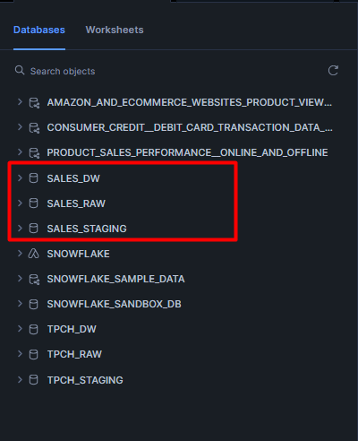

#### Extract Data from the Original Source to the Raw Database  
The second step involves extracting the data from Grips Intelligence. The original table contains approximately 19.5 million records, with information related to product sales.

#### Load Data into the Staging Database and Apply Transformations  
The data extracted into the Raw database is loaded into the Staging database, where transformations are applied.  
Transformations applied:
- Creation of the staging table `PRODUCT_SALES_PERFORMANCE_STAGING`.
- Truncation of the staging table to remove previous data.
- Loading data from the table `SALES_RAW.PUBLIC.PRODUCT_SALES_PERFORMANCE` into the staging table.
- Replacing null values in the column `REVENUEUSD` with the median of the existing values.
- Adding the column `STORE_TYPE`, classifying sales as ONLINE or OFFLINE based on SKU and URL.
- Adding the column `YEAR`, extracted from the `DATE` column for easier yearly analysis.
- Adding the column `MONTH`, extracted from the `DATE` column for easier monthly analysis.
- Adding the column `DAY`, extracted from the `DATE` column for easier daily analysis.

**Note:** The transformations applied, like replacing null values with the median, were quick fixes, but not necessarily the best solutions. It’s important to track the history of transformations, and tools like DBT can help with that by maintaining a clear data lineage, which was missing in this case. 

#### Load Data into the DW, Build a Star Schema Model, and Create Views to Answer Business Questions  
In the Data Warehouse (DW) stage, the transformed data is organized into a **star schema model**, with fact and dimension tables. Views will be created to facilitate analysis and answer business questions.  
#### Data Warehouse Modeling:
- `dLocation`: Location table containing information about stores, such as store ID, ZIP code, city, state, and address.
- `dProduct`: Product table containing information such as product ID, SKU, title, and brand.
- `dSalesChannel`: Sales channel table with channel ID and store type (ONLINE or OFFLINE).
- `fSales`: Fact table for sales, joining `dLocation`, `dProduct`, and `dSalesChannel` tables, containing information about SKU, store ID, product ID, sales channel ID, date, sales quantity, and total sales in dollars.
- `dCalendar`: Calendar table containing information about the date, year, month, and day, extracted from the sales table.  

#### Created Views:
1. `VW_TOTAL_SALES_BY_CHANNEL`: Total sales of each product by sales channel (ONLINE/OFFLINE) for each store in September 2024.
2. `VW_10_BEST_SELLING_PRODUCTS`: The 10 best-selling products by state and city, with total sales for each location.
3. `VW_PERCENT_VARIATION_CHANNEL`: Percentage variation of total sales for each product between ONLINE and OFFLINE channels.
4. `VW_CUM_SALES_STORES`: Cumulative sales by store, state, and product throughout September 2024, showing sales evolution over the month.
5. `VW_AVG_DAILY_SALES`: Average daily sales by store and product, segmented by sales channel (ONLINE/OFFLINE).

### Business Questions Answered:
1. What were the total sales of each product by sales channel (ONLINE/OFFLINE) for each store in September 2024?
2. What were the 10 best-selling products by state and city in September 2024, and what was the total sales for each location?
3. What was the percentage variation in total sales of each product between ONLINE and OFFLINE channels in September 2024?
4. What were the total cumulative sales by store, state, and product throughout September 2024, and how did these sales evolve during the month?
5. What was the average daily sales by store for each product, segmented by sales channel (ONLINE/OFFLINE)?

#### Monitor Each ETL Stage to Track Query Performance  
Throughout the process, it will be important to monitor query performance at each stage of the ETL. This will serve as a basis to compare performance between the traditional process and the ELT model using DBT.

## ETL Process Cost and Performance Analysis

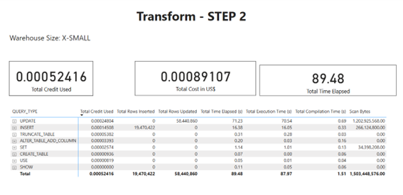

[Report](https://app.powerbi.com/view?r=eyJrIjoiNDZmNzc5YjctOTJlZi00Nzk1LTg5OWMtZjExMGEzMWU0M2E4IiwidCI6ImYwZGU2ZTJmLWFiZTgtNGQ1OS05Yzc1LWU4ODdhMTUwN2IxYiIsImMiOjl9)

Upon reviewing the results of each stage of the ETL process, we can identify optimization opportunities, particularly with the shift to the ELT flow where data is directly loaded into the Data Warehouse and transformations are performed there. This eliminates the need for the Staging stage and offers the opportunity to improve the process with tools like DBT. By leveraging DBT, we can implement data lineage, which allows us to map data changes, track the flow of transformations, and automatically generate documentation and tests.   
#### Observations:  
- **Stage 3 (Load)**, despite having the shortest execution time (9.91 seconds), was the most expensive in terms of credits used (0.00072189) and total cost (0.00122721 USD), highlighting that data loading with INSERTs has a significant impact.  
- **Stage 2 (Transform)**, being the longest, will certainly benefit from using DBT to transform data directly in the Data Warehouse.

## What is DBT?

DBT (Data Build Tool) is a tool that brings software engineering best practices into the data space, particularly in the transformation process. Its goal is to help data analysts and engineers create more structured, reusable, and maintainable data models, much like how software code is developed and maintained.

DBT is especially useful for ensuring the **quality and reliability of data** through **automated tests**. This means you can verify that the data is as expected and catch issues before they become critical. Additionally, it facilitates **code reuse**, making the creation of new data models more efficient and consistent.

Another advantage of DBT is that it provides **data lineage**, meaning it maps the path of data from its origin to the final model, offering a clear view of the transformations that occurred. This helps understand how data has been manipulated and whether changes in sources can affect the analyses.

Moreover, DBT automatically generates **documentation**, making teamwork and communication easier about what is being done with the data. As a result, DBT solves many issues that arise in data transformation processes, such as lack of traceability, challenges in code maintenance, and the absence of guarantees about data quality. It thus becomes an essential tool for building more robust and scalable data pipelines.

## Organization in DBT

My DBT project is organized as follows:

- **Models**: Contains the SQL models, which are responsible for creating tables and views in the Data Warehouse.
- **sales**: Contains the views that will be directly consumed in business analysis.
- **sources.yaml**: The sources.yml file is used to define the data sources for the project.
- **analyses**: Contains auxiliary analysis scripts that are not part of the transformation pipeline.
- **Logs**: Stores DBT execution logs.
- **macros**: Stores reusable macros that can be used in various models, helping to avoid code duplication.
- **seeds**: Contains data files that can be loaded directly into the Data Warehouse as tables.
- **snapshots**: Used to take snapshots of the data, allowing versioning or historical tracking of tables.
- **dbt_project.yml**: The main configuration file for DBT, where the project configurations are defined, including model definitions and packages.

The project will use **Snowflake** to execute queries, leveraging its scalable cloud infrastructure optimized for data analysis, ensuring performance and efficiency in processing transformations and queries.

## Defining the Type of Materializations

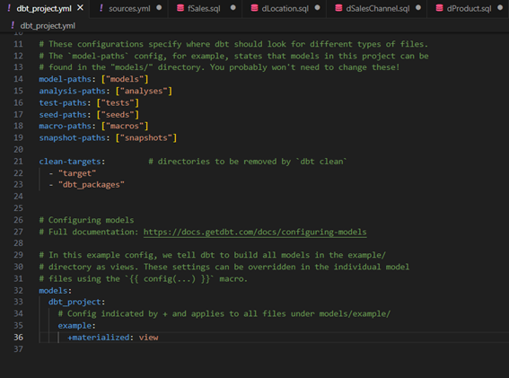

By default, the materialization type defined is **"view"**.

Below is a brief explanation of the materialization types:

- **View (view)** – Creates a view in the database without physically storing the data; the query is executed every time it is accessed.
- **Table (table)** – Creates a physical table in the database and overwrites it with each execution of dbt run, storing the materialized data.
- **Incremental (incremental)** – Updates only the new or modified records instead of recreating the entire table, optimizing performance.
- **Ephemeral (ephemeral)** – Temporary models that do not generate tables or views, being directly incorporated into other queries.
- **Materialized View (materializedview)** – Similar to a view but stores results to optimize performance with large data volumes (support depends on the database).

A best practice is to split large models into smaller models. The **fSales** table, being a fact table with a large volume of rows, will be stored as a **'table'** and later defined as **incremental**, as it is updated daily. On the other hand, the dimension tables, which have fewer rows, will be stored as **views**. This is the strategy I will adopt.

To define materializations for the entire project, I can create a macro and remove the concatenation logic as shown below. This is done because I cannot overwrite directly.

Reference: [https://docs.getdbt.com/docs/build/custom-schemas](https://docs.getdbt.com/docs/build/custom-schemas)

To organized the project better, I created a dedicated schema in Snowflake for the views that answer business questions, and I have already defined all materializations directly in the **.yml** file to avoid configuring each model individually. One of the best practices of dbt is **"do not repeat yourself"**.

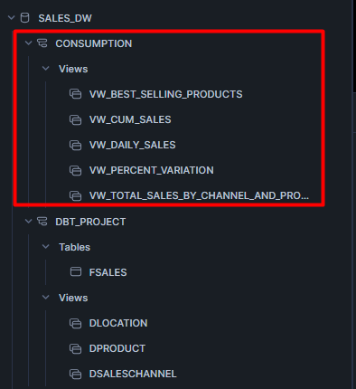

Now, I'll provide a brief overview of the main components of dbt.

## Seeds

Seeds are CSV files stored in the dbt repository that can be loaded as tables into the target database. In this case, as an example, I will load a CSV file with daily targets for September 2024. 

To do this, it's very simple—just create the CSV file inside the `seeds` folder and input the data. After that, simply run the `dbt seed` command.

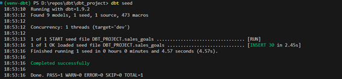

## Analyses
The **analyses** section is used for testing queries. The difference is that the queries will not be materialized in Snowflake, as happens with models. It is useful for compiling the queries that are being executed in Snowflake.

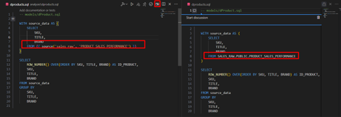

### Sources

In dbt, **sources** are used to map external tables (already existing in the database) and use them within dbt in an organized and standardized way.  
In the image below, I am referencing the `PRODUCT_SALES_PERFORMANCE` table within Snowflake to be used in dbt.

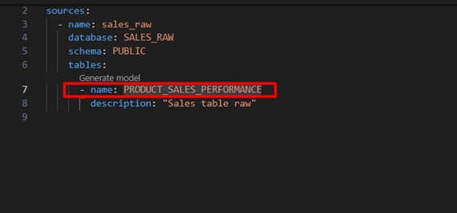

The syntax to reference source is as shown below:

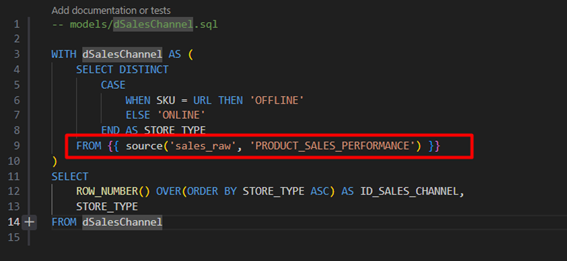

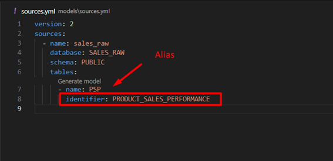

### Tests

In dbt, **tests** are automatic checks that ensure the data is correct and follows the defined rules. They help avoid issues before the data is consumed by analyses and dashboards.  
There are two main types of tests:

#### Generic tests:
These are predefined dbt tests that can be applied to any table or column, such as:
- `not_null`: Ensures there are no null values.
- `unique`: Checks if the values in a column are unique.
- `accepted_values`: Verifies if the values belong to a specific set.
- `relationships`: Ensures referential integrity between tables.

Generic tests should be created with a `.yml` file inside the models directory.  
Example:

#### Singular Tests

**Singular tests** are custom SQL queries that check more specific business rules, such as:
- "No sale can have a negative value."
- "Each SKU must be registered in the products table."
- "There cannot be more than one row per day for the sales target."

Example:  
I want to check if there are NULLs in the `TITLE` or `BRAND` columns in the products table.

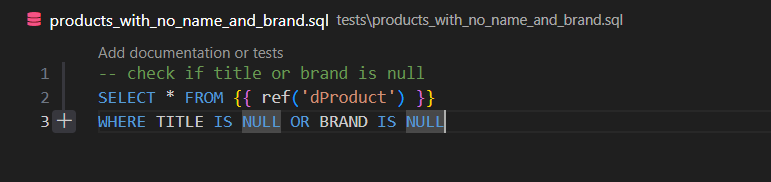

Finally, to run the tests, simply use the command `dbt test`, and it will execute all the tests:

This is very helpful in detecting data anomalies and issues in the modeling.

## DBT Documentation

Documentation in dbt is a major differentiator because it integrates code and explanations in one place, making everything clearer and more accessible to the team. In the past, code and documentation were kept separate, leading to outdated information and communication difficulties between teams. With dbt, this integration ensures that any changes in the data model are accompanied by the correct explanation, preventing miscommunication and making the project more reliable.

Additionally, documenting models brings several advantages, such as:
- **Improves communication with stakeholders**: it makes the data easier to understand for the whole team, not just the developers.
- **Makes the project easier to understand and maintain**: team members who join later or revisit the code after some time can quickly comprehend the logic behind the transformations.
- **Speeds up onboarding for new members**: new members can get up to speed with the project without having to ask the whole team.
- **Creates a self-service portal for common queries**: it avoids rework by centralizing useful information that anyone can access when needed.
- **Ensures code and documentation evolve together**: since everything is version-controlled in the repository, there's no risk of the documentation becoming outdated.

In dbt, documentation is done within YAML files, where we can describe the models, tables, and columns. It's also possible to add docblocks directly in the SQL files to explain more complex transformations. To do this, a `.md` file is created, and the documentation is inserted as shown below:

For more details on dbt documentation, visit the [official dbt documentation](https://docs.getdbt.com/docs/build/documentation).

### To generate documentation:
1. Use the command `dbt docs generate` to generate the documentation.
2. To serve an HTML version of the documentation, run the command `dbt docs serve`.

In the documentation, we can go into detail about each object in the model, such as its dependencies, SQL query, data lineage, tests, etc. It is also possible to view the data lineage graph. This is important for understanding how data flows from the original source to the final tables for consumption.

## JINJA

Jinja is a template engine widely used to generate dynamic code, such as SQL in dbt, HTML in web frameworks (like Flask and Django), and even for script automation. It allows you to include logic within text, making code writing more flexible and reusable.

In dbt, Jinja is used to dynamize SQL queries, allowing the creation of parameterized models, loops, conditionals, and macros.

[Jinja docs](https://jinja.palletsprojects.com/en/stable/)

## Control Statements (Declarações de Controle)
- Allow adding conditional logic and loops within the template.
- Written between .

## Expressions (Expressões)
- Used for calculations and displaying variables.
- Written between {{ ... }}.

## Texts (Textos)
- Fixed parts of the template that are not processed by Jinja.
- In dbt, these are typically parts of the SQL code that will be executed directly.

## Comments (Comentários)
- Allow adding explanatory notes within the code without impacting its execution.
- Written between {# ... #}.

### Example:
You can create logic using Jinja that dynamically filters your sales from September, from day 1 to day 15.

using the defined macro

## Macros
Macros in dbt are blocks of code written in SQL and Jinja that allow you to reuse logic within your models. We can compare them to functions in programming languages.

In the example below, I created a macro to replace null values:

usign the created macro in sql code

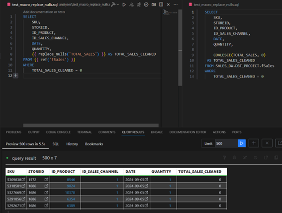

## Packages

Packages in dbt function like libraries or modules that help extend the functionality of dbt, similar to a Python package, for example. They can include macros, models, tests, and configurations that can be shared across projects.

The most common and widely used packages can be found at: [https://hub.getdbt.com/](https://hub.getdbt.com/)

The `dbutils` package already includes several generic tests and macros. Its implementation is also quite simple:

### Implementing the Unique Combination of Columns Test

This test is quite useful when we have a fact table and want to find a unique ID for each row in the table by combining several columns.

In this case, I will start by testing the `STOREID` and `DATE` columns.

As shown below, the test failed, and 45,598 combinations were found using the `STOREID` and `DATE` columns.

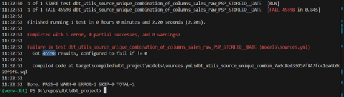

We can also see the logic that the test is performing in the GitHub repository. Essentially, this is the check that the function is executing.

### Configuring the fSales Table as Incremental

In this step, I will configure the fSales table to be incremental. The idea is for it to be updated with data from the last day whenever the dbt model is run.  
To achieve this, I will configure the logic inside the model.

Now, I will insert 10 rows into my SALES_RAW table with data from October 2024, as the database currently only contains sales data from September 2024.

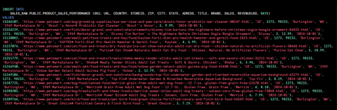

After running the model, I see that the test passed. This means that the table was not dropped and reloaded in the Data Warehouse (DW), but only the new data was included.

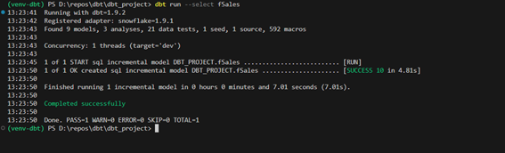

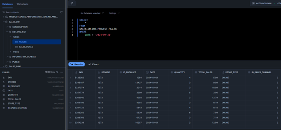

In addition, I also want to ensure that if new records with the same primary key enter, they will be updated. To do this, it's very simple: just specify a unique identifier in the configuration. In my case, since I don't have a primary key yet, I used a combination of columns as a unique identifier (during the test, I confirmed that this combination of columns uniquely identifies each row in the table).

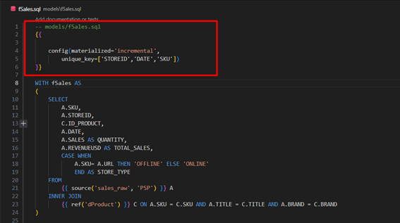

### Snapshots

In DBT, snapshots are used to capture and store historical versions of data over time. They are useful when you want to track changes in records, such as updates or deletions of data in a table. A snapshot creates a copy of the data in the destination table whenever there is a change, allowing you to maintain a complete history of changes. This is important for tracking dimensions that change over time or SCD (Slowly Changing Dimension).

There are three main types of SCD:
- **SCD Type 1 (Overwrite):**
  - When there is a change in a dimension attribute, the old value is overwritten by the new value. This means you lose the history and only keep the most recent value.
  - Example: If a customer's address changes, the old address is lost and replaced by the new one.

- **SCD Type 2 (Historical Tracking):**
  - In this case, when a change occurs, the old version of the record is kept, and the new version is added with a version key or validity date. This allows you to keep a complete history of changes.
  - Example: If a customer's address changes, the new version of the customer will be created, but the previous version will be maintained with the validity date of when the address was changed.

- **SCD Type 3 (Limited History):**
  - Type 3 allows you to store a limited amount of history, usually just the previous version. This means you keep the current value and the previous value of an attribute.
  - Example: If a customer's address changes, you keep both the current and the previous address in separate columns.

DBT doesn't have a built-in SCD functionality by default, but it offers ways to efficiently implement SCD Type 2 using snapshots. In DBT, snapshots are used to capture changes in dimensions, essentially implementing SCD Type 2.

I will now create a snapshot for the `dLocation` table. This will maintain a history if a store changes its address or state.

First, I need to create the snapshot.

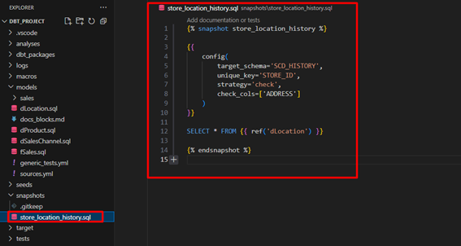

When running dbt, it creates a history column.

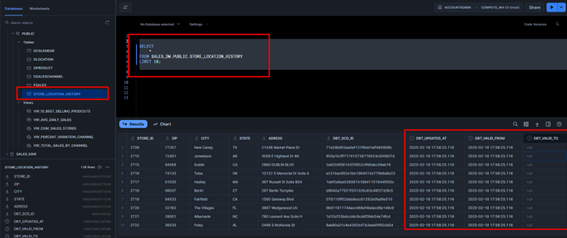

Simulating a store change

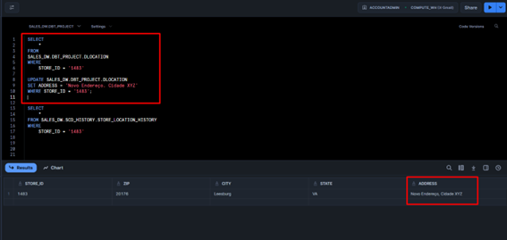

After the snapshot, I verify that the store's change history was correctly mapped in the table with SCD Type 2.

## Mapping dbt Implementations
To map the implementations made in dbt, I need to define a `query_tag` within the `profiles.yml`.

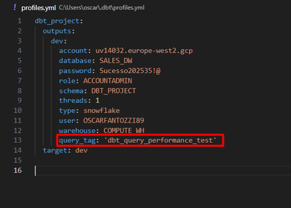

### Comparing the Results

In this part of the process, I ran all the **models**, along with the **tests**, **snapshots**, and even generated the **documentation**. Therefore, it is expected that there will be higher resource consumption in the Data Warehouse (DW) due to the execution of these additional processes.

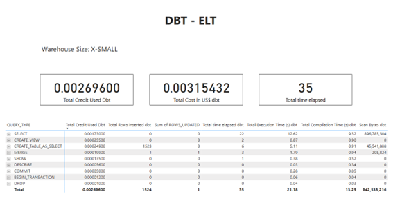

### Comparison Between Traditional ETL and DBT Process

| **Aspect**               | **ETL Traditional (Snowflake)**                                                              | **ELT (DBT)**                                                                                                                                         |
|--------------------------|---------------------------------------------------------------------------------------------|-----------------------------------------------------------------------------------------------------------------------------------------------------|
| **Execution Time**        | Slower due to processing in the intermediate Staging steps                                  | Much faster due to processing directly in the Data Warehouse (Snowflake), without intermediate steps                                               |
| **Scalability**           | Much faster due to processing directly in the Data Warehouse (Snowflake), without intermediate steps | Highly scalable, as transformations are done in the DW, taking advantage of Snowflake's infrastructure                                              |
| **Credit Cost**           | Lower credit cost, as transformations are not done within the DW                             | Higher credit cost, as transformations are done within Snowflake                                                                                    |
| **Maintainability**       | Harder to maintain, especially as transformation complexity increases                         | Easier to maintain with modular code, macro reuse, and clearer transformations                                                                    |
| **Data Quality**          | Higher risk of errors, as data is transformed outside the DW, which can lead to inconsistencies | Better data quality, with integrated automated tests and easier detection of errors in transformations                                            |
| **Query Flexibility**     | Less flexible in terms of queries, as transformations are done outside the DW                | Extremely flexible with the use of Jinja to parameterize queries and make transformations dynamic                                                 |
| **Documentation and Transparency** | Documentation may be separate and less clear about the origin and flow of data             | Integrated documentation with the data model, making it easier to understand and communicate within the team                                       |
| **Automated Tests**       | Less focus on tests, requiring manual test configuration in the transformation steps         | Automated data quality and integrity tests are easier to implement and run                                                                          |

Based on the results, the ELT process with DBT proves to be more efficient in terms of execution time, taking only 35 seconds compared to the 117.36 seconds of the traditional ETL. 

Additionally, DBT shows a lower credit cost (0.00269600) compared to ETL (0.00151405), although DBT's total cost is slightly higher (0.00315432 vs. 0.00243185 for ETL). This is because DBT performs transformations directly in the Data Warehouse, leveraging its processing infrastructure, but this model consumes more computational resources. 

Therefore, DBT offers advantages in speed and flexibility, especially in scalable environments, but with a slightly higher cost. The traditional ETL, on the other hand, is more economical in terms of credit usage but slower and less flexible.

### Conclusions and Next Steps

In recent years, data architecture has undergone significant changes, driven by technological advancements and the evolving demands of businesses. One of the most interesting approaches I've come across is DBT, which brings software engineering practices to the world of data. The integration of concepts like modularity, test automation, and code versioning has the potential to improve not only the efficiency of data transformations but also the maintainability and scalability of data pipelines.

Overall, I found DBT to be an extremely useful tool. For those already familiar with SQL, the learning curve is relatively quick, allowing for the immediate implementation of best practices. It truly simplifies data transformation, providing more refined control and a more agile workflow. This experience has been highly enriching, and without a doubt, it was worth exploring the tool in depth.

As next steps, I plan to dive deeper into DBT's testing packages, exploring how to automate and ensure data quality in different scenarios. Additionally, I aim to orchestrate the ETL process using Airflow to have more control over the execution and scheduling of the pipelines, ensuring greater flexibility and robustness in the data flow. This will optimize the transformation process and ensure that the pipeline operates continuously and efficiently, meeting more complex demands and increasing the reliability of operations.
